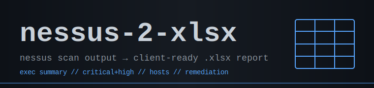

<p align="center">
  
</p>

Take Nessus scan output and turn it into a client-ready `.xlsx` summary.

**Author:** SkyzFallin

## What It Does

`nessus-2-xlsx` parses a raw `.nessus` XML export and produces a single,
formatted Excel workbook ready to hand to a client — no manual cleanup, no
copy-paste from the Nessus UI.

In one run it will:

- Parse every `ReportHost` / `ReportItem` from the `.nessus` file, pulling
  IP, hostname, OS, port/protocol, plugin metadata, CVSS, CVE, synopsis,
  description, solution, and (truncated) plugin output.
- Drop informational findings (severity 0) so the report shows only what
  matters.
- Prefer the CVSS v3 base score, falling back to CVSS v2 when v3 is absent.
- Build a five-tab, color-coded workbook with severity-styled cells,
  auto-filters, frozen headers, and embedded charts.

Turns the usual "export, clean, pivot, format" spreadsheet grind into a
single command.

## Setup

Install the three dependencies, then run the script against a `.nessus` file:

```bash
pip install openpyxl pandas matplotlib
python3 nessus_to_xlsx.py scan.nessus                     # auto-names output
python3 nessus_to_xlsx.py scan.nessus custom_report.xlsx  # custom name
```

With no output path, the report is written next to the script as
`<scan>_Vulnerability_Report.xlsx`.

## Output

A single `.xlsx` workbook with five tabs:

| Tab | Contents |
| --- | --- |
| **Executive Summary** | Key metrics, a severity-distribution pie chart, a top-vulnerabilities bar chart, and a ranked Critical & High table. |
| **Critical & High Findings** | Prioritized remediation list (Critical + High only), sorted by severity then CVSS, with auto-filter and frozen header. |
| **All Findings** | The full non-informational dataset — every column, filterable. |
| **Hosts Summary** | Per-host vulnerability counts by severity, sorted by risk. |
| **Remediation Priorities** | Deduplicated vulnerabilities grouped for patching, with affected host counts, solutions, and affected IPs. |

Severity is color-coded throughout — Critical (red), High (orange),
Medium (yellow), Low (blue).

## Usage

```
python3 nessus_to_xlsx.py <scan.nessus> [output.xlsx]

Arguments:
  scan.nessus    Path to the Nessus XML export (.nessus)
  output.xlsx    Optional output path
                 (default: <scan>_Vulnerability_Report.xlsx)
```

## Notes

- **Informational findings are skipped.** Only severities Low and above are
  included in the report.
- **CVSS v3 preferred.** The script reads `cvss3_base_score` and falls back
  to `cvss_base_score` when v3 isn't present.
- **Plugin output is truncated** to the first 500 characters in the
  *All Findings* tab to keep cells readable.
- **Two chart engines.** The pie chart is a native Excel chart (openpyxl);
  the top-vulnerabilities bar chart is rendered with matplotlib (`Agg`
  backend) and embedded as an image, so no display is required.
- **No findings, no file.** If the scan contains only informational items,
  the script reports that and exits without writing a workbook.

## Changelog

- **v1.0.0** — Initial release. `.nessus` parser, five-tab formatted
  workbook (Executive Summary, Critical & High, All Findings, Hosts
  Summary, Remediation Priorities), severity color-coding, pie + bar
  charts.

## Roadmap

- Optional CSV / Markdown export alongside the workbook.
- Multi-file mode — merge several `.nessus` exports into one report.
- Scan-diff mode — compare two scans to highlight new and remediated
  findings.

## Credits

Built by SkyzFallin.

## License

[MIT](LICENSE).
